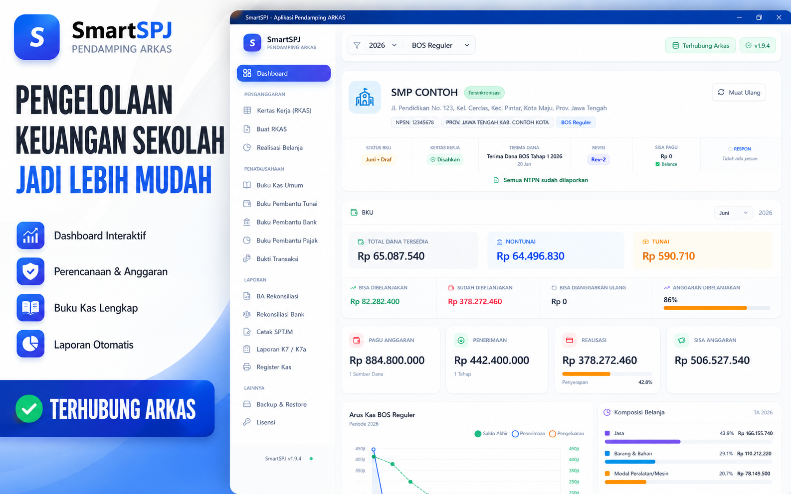

# SmartSPJ

<h1 align="center">SmartSPJ</h1>

<b>Desktop Companion for ARKAS</b> 
Aplikasi desktop modern untuk membantu bendahara sekolah menyusun
SPJ BOS, laporan keuangan, dan dokumen pertanggungjawaban secara
lebih cepat, rapi, dan akurat.

<a href="https://github.com/kevindoni/SMARTSPJ_APP_NEW/releases">Download</a>
• <a href="#fitur">Features</a>
• <a href="#screenshot">Screenshots</a>
• <a href="#keamanan">Security</a>
• <a href="docs/PANDUAN_LENGKAP.md">Documentation</a>

---

## Dashboard

---

## Tentang

SmartSPJ merupakan aplikasi desktop pendamping **ARKAS** yang dirancang untuk membantu bendahara sekolah dalam mengelola seluruh proses administrasi BOS.

Aplikasi bekerja dengan prinsip **Read Only**, sehingga database ARKAS tidak pernah dimodifikasi. Seluruh analisis, laporan, pencetakan dokumen, dan ekspor dilakukan dari salinan data yang aman.

---

# Fitur

| Modul        | Deskripsi                                        |
| ------------ | ------------------------------------------------ |
| Dashboard    | Statistik keuangan, grafik, saldo, analitik BOS  |
| RKAS Creator | Penyusunan RKAS, proporsi, realisasi anggaran    |
| Buku Kas     | BKU, Buku Tunai, Buku Bank, Buku Pajak           |
| Rekonsiliasi | BA Rekonsiliasi, Rekonsiliasi Bank, Kertas Kerja |
| Dokumen      | Kwitansi, Bukti Pengeluaran, SPTJM, Register Kas |
| Laporan      | K7, K7a, Realisasi Belanja, Rekap Saldo          |
| Export       | PDF, Excel, HTML                                 |
| Backup       | Backup & Restore Konfigurasi                     |

---

## RKAS Creator

---

# Yang Baru

## v1.11.4

### Realisasi Anggaran

* Tracking realisasi per item RKAS
* Perhitungan selisih anggaran
* Smart Reconciliation
* Detail aliran dana

### Sinkronisasi ARKAS

* Deteksi RKAS usang
* Tombol sinkronisasi
* Validasi data otomatis

### Peningkatan

* Perbaikan realisasi ganda
* Optimasi performa
* Akurasi laporan meningkat

---

# Teknologi

| Komponen  | Teknologi        |
| --------- | ---------------- |
| Framework | Electron 28      |
| UI        | React 18         |
| Build     | Vite 5           |
| Styling   | TailwindCSS      |
| Database  | SQLCipher        |
| Grafik    | Chart.js         |
| Excel     | ExcelJS          |
| PDF       | jsPDF & PDFKit   |
| Update    | Electron Updater |
| Proteksi  | Bytenode         |

---

# Keamanan

| Layer       | Implementasi              |
| ----------- | ------------------------- |
| Database    | SQLCipher Encryption      |
| ARKAS       | Read Only Access          |
| Credential  | Electron safeStorage      |
| Windows     | DPAPI                     |
| License     | Ed25519 Digital Signature |
| Device      | Hardware Fingerprint      |
| Source Code | Bytenode (.jsc)           |

---

# Screenshot Lainnya

---

# Download

### Download versi terbaru

https://github.com/kevindoni/SMARTSPJ_APP_NEW/releases

> **Windows SmartScreen**
>
> Karena aplikasi belum menggunakan Code Signing Certificate publik, Windows dapat menampilkan peringatan saat instalasi. Pilih **More info → Run anyway** untuk melanjutkan.

---

# Dokumentasi

| Dokumen            | Keterangan         |
| ------------------ | ------------------ |
| PANDUAN_LENGKAP.md | Panduan penggunaan |
| CHANGELOG.md       | Riwayat perubahan  |
| LICENSE            | Lisensi            |

---

# Lisensi

Copyright © 2024–2026 KevinDoni.

SmartSPJ didistribusikan menggunakan **SmartSPJ Proprietary License**.

Seluruh hak cipta dilindungi.

---

<b>SmartSPJ</b> 
Desktop Companion for ARKAS

